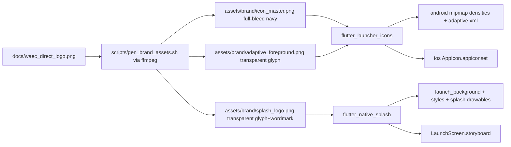

# Plan — Fix WAEC Direct Logo & Splash Screen (Android physical device, debug)

## Diagnosis (confirmed)

1. **Orphaned assets.** `mobile/assets/logo.png` and `mobile/assets/splash.png` are declared in `pubspec.yaml` but referenced by **zero** Dart files (`Image.asset` search: 0 hits). No `flutter_launcher_icons` / `flutter_native_splash` configured. Updating these files therefore changes nothing on device.
2. **Bad master image.** `docs/waec_direct_logo.png` (= `assets/logo.png`) is a navy _rounded_ square on an **opaque white** canvas. Every derived asset inherits the white corners:
   - `res/mipmap-xxxhdpi/ic_launcher.png` → white box around the icon (legacy launchers).
   - `ios/.../Icon-App-1024x1024@1x.png` → white square ring; `scripts/gen_ios_icons.sh` colorkey (`0xFFFFFF:0.18:0.10`) fails on anti-aliased off-white pixels and its "invert dark glyph to white" assumption is now inverted (glyph is already light).
3. **Stale Android splash/foreground drawables.** `drawable-nodpi/splash_logo.png` and `drawable-nodpi/ic_launcher_foreground.png` are faded, semi-transparent keying artifacts. `launch_background.xml` plumbing is correct but composites a broken bitmap.
4. **No Android regeneration script exists** — only `scripts/gen_ios_icons.sh`. Native resources drifted from the brand with no pipeline to resync.
5. **iOS launch screen unbranded** — stock Flutter template (white background, placeholder `LaunchImage`).
6. **Cache masking** — launcher icon caches + Gradle resource caching mean fixes won't appear on a physical device without `flutter clean` + **uninstall/reinstall** of `gh.com.waecplatform.waecdirect`.

## Chosen approach

Standard, reproducible pipeline with **`flutter_launcher_icons` + `flutter_native_splash`** (dev dependencies), fed by clean pre-processed brand masters generated once with `ffmpeg` (already used by `gen_ios_icons.sh`; no ImageMagick dependency).

## Brand pipeline

## Steps

1. **Create `scripts/gen_brand_assets.sh`** (ffmpeg): colorkey the white canvas out of `docs/waec_direct_logo.png`, then composite the glyph over a **full-bleed `#0A2540` square** → `mobile/assets/brand/icon_master.png` (1024px, no white corners). Also emit `adaptive_foreground.png` (transparent, glyph pre-scaled ~66 % of canvas for the adaptive safe zone) and `splash_logo.png` (transparent shield glyph + "WAEC Direct" wordmark region for the splash).
2. **Add dev dependencies** to `mobile/pubspec.yaml`: `flutter_launcher_icons`, `flutter_native_splash` (latest compatible with Dart SDK ^3.13.2); run `flutter pub get`.
3. **Configure `flutter_launcher_icons`** (pubspec): `image_path: assets/brand/icon_master.png`, `adaptive_icon_background: "#0A2540"`, `adaptive_icon_foreground: assets/brand/adaptive_foreground.png`, `remove_alpha_ios: true`, Android + iOS on.
4. **Configure `flutter_native_splash`** (pubspec): background `#0A2540` (light **and** dark), `image: assets/brand/splash_logo.png`, plus an `android_12:` block (icon + icon background) so Android 12+ devices show the branded SplashScreen API screen, not the generic icon.
5. **Run generators**: `dart run flutter_native_splash:create && dart run flutter_launcher_icons`. Verify they overwrite `res/mipmap-*`, `res/drawable*/launch_background.xml`, `res/values{,-night}/styles.xml`, `colors.xml`, and the adaptive `ic_launcher.xml` cleanly.
6. **Reconcile theme files**: confirm `LaunchTheme` keeps `windowBackground → launch_background` and `NormalTheme` keeps the navy background (no white flash behind Flutter UI). Keep `values-night` consistent.
7. **iOS housekeeping** (secondary; generation requires macOS): fix `scripts/gen_ios_icons.sh` (drop the obsolete invert step, widen colorkey tolerance) and hand-set `LaunchScreen.storyboard` background to `#0A2540` so the repo is correct even though verification target is Android.
8. **Static checks**: `flutter analyze`, `flutter build apk --debug`.
9. **Physical-device verification (debug)**: `flutter clean` → **uninstall** `gh.com.waecplatform.waecdirect` from the phone (clears launcher icon cache) → `flutter pub get` → re-run generators → `flutter run --debug`. Confirm: (a) launcher icon = clean full-bleed navy adaptive icon, (b) cold start shows branded navy splash, (c) no white flash, (d) Android 12+ SplashScreen API screen branded.
10. **Document**: add a short "Regenerating brand assets" section to `mobile/README.md` so future brand changes flow through the pipeline.

## Guardrails (AGENT.md compliance)

- No changes to crypto, network, storage, or service code — assets + dev tooling only.
- `assets/logo.png` / `assets/splash.png` remain bundled (harmless) but the pipeline masters live in `assets/brand/`.
- Design tokens unchanged: navy `#0A2540`, mint `#00D4B1`.
