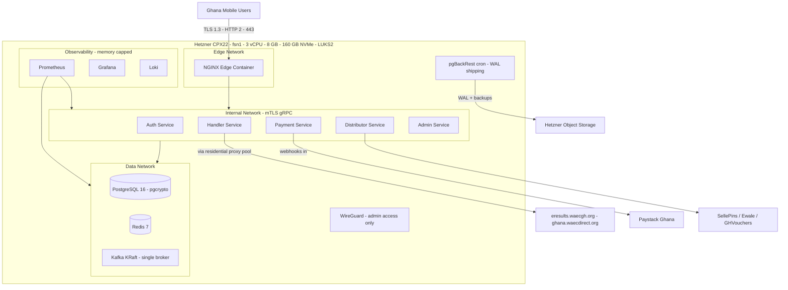

# Hetzner Infrastructure Plan — Single-Node Deployment (CPX22)

**Parent plan:** [`plans/waec-app-enterprise-plan.md`](waec-app-enterprise-plan.md)
**Provider:** Hetzner Cloud (hcloud)
**Topology:** One shared server — all workloads containerized via Docker Compose
**Status:** Proposed — pending user approval
**Revision:** 2 — replaces the multi-node k3s design for cost optimization at launch

---

## 1. Node Specification & Cost

### 1.1 Chosen Server

| Property   | Value                                                             |
| ---------- | ----------------------------------------------------------------- |
| Model      | **CPX22** (shared vCPU, AMD EPYC)                                 |
| vCPU       | 3 dedicated-core share (shared compute line)                      |
| RAM        | **8 GB**                                                          |
| Disk       | **160 GB local NVMe**                                             |
| Traffic    | 20 TB/month included                                              |
| Location   | Falkenstein `fsn1` (primary; `nbg1`/`hel1` acceptable alternates) |
| Est. price | **≈ €10.6 / month** (verify current pricing at provision time)    |

### 1.2 Total Monthly Cost

| Item                                                              | Est. €/mo            |
| ----------------------------------------------------------------- | -------------------- |
| CPX22 server                                                      | ~10.6                |
| Hetzner automated backups (+20%)                                  | ~2.1                 |
| Object Storage (backups, WAL archive, Terraform state) ~50–100 GB | ~2–5                 |
| **Total**                                                         | **≈ €15–18 / month** |

No Load Balancer, no extra Volumes, no separate data VMs — the public IPv4 on the server terminates TLS directly in NGINX.

### 1.3 Accepted Trade-offs (documented risk acceptance)

| Trade-off                                                  | Mitigation                                                                                                                                                                                           |
| ---------------------------------------------------------- | ---------------------------------------------------------------------------------------------------------------------------------------------------------------------------------------------------- |
| **Single point of failure** — node loss halts the platform | Hetzner automated backups + pre-deploy snapshots + pgBackRest WAL archive → full rebuild from IaC within RTO ≤ 2 h (§8). Zero raw grades stored server-side, so node loss never loses candidate data |
| No HA for PostgreSQL / Redis / Kafka                       | Single instances with strong backup discipline; HA deferred until scale triggers fire (§11)                                                                                                          |
| No horizontal scaling                                      | Vertical upgrade path first (CPX32/42/52), then data-tier split, then the multi-node k3s design (archived in git history of this file)                                                               |
| Shared vCPU line                                           | Sufficient for launch traffic; Handler scraping is I/O-bound; upgrade trigger defined in §11                                                                                                         |

---

## 2. Topology



**Container networks:** `edge` (NGINX ↔ services), `internal` (service ↔ service, mTLS), `data` (services ↔ PostgreSQL/Redis/Kafka). No data container is ever on the `edge` network.

---

## 3. Runtime Platform — Docker Compose (not Kubernetes)

| Decision                                                  | Rationale                                                                                                                                                                                |
| --------------------------------------------------------- | ---------------------------------------------------------------------------------------------------------------------------------------------------------------------------------------- |
| **Docker Compose v2** instead of k3s                      | Single node: k3s + etcd + CCM/CSI overhead (~1 GB RAM, operational complexity) buys nothing. Compose gives restart policies, healthchecks, resource limits, and identical dev/prod files |
| `restart: unless-stopped` + healthchecks on every service | Self-healing after crashes and reboots                                                                                                                                                   |
| `mem_limit` / `cpus` on every container                   | Enforces the §4 memory budget; one runaway service cannot OOM the node                                                                                                                   |
| `docker compose -f compose.yaml -f compose.prod.yaml`     | Same files for local dev (parent plan Phase 1.5) and production — dev adds a `compose.dev.yaml` override with mock WAEC portals                                                          |
| Deploys                                                   | `docker compose pull && docker compose up -d` from CI (GitHub Actions over SSH via WireGuard); pre-deploy Hetzner snapshot taken by deploy script                                        |
| Edge TLS certificates                                     | Let's Encrypt via NGINX (certbot container or webroot); internal mTLS via the internal PKI (parent plan Phase 1.3)                                                                       |

---

## 4. Memory Budget (8 GB node)

| Component                    | RAM limit    | Notes                                                              |
| ---------------------------- | ------------ | ------------------------------------------------------------------ |
| OS + Docker daemon + system  | ~1.0 GB      | Ubuntu 24.04 LTS, unattended-upgrades                              |
| PostgreSQL 16                | 1.5 GB       | `shared_buffers=1GB`, tuned for 8 GB node                          |
| Redis 7                      | 0.25 GB      | Sessions + 24 h grace TTL keys only                                |
| Kafka (KRaft, single broker) | 1.0 GB       | `KAFKA_HEAP_OPTS=-Xmx512m -Xms512m`; RF=1, `min.insync.replicas=1` |
| 5 Rust services              | 0.75 GB      | 150 MB each — Rust/Tokio footprint is small                        |
| NGINX edge                   | 0.06 GB      | TLS termination, Brotli/Gzip, rate limiting                        |
| Prometheus                   | 0.5 GB       | 15 d retention, reduced scrape targets                             |
| Grafana                      | 0.25 GB      |                                                                    |
| Loki                         | 0.25 GB      | 7 d retention; audit logs mirrored to PostgreSQL                   |
| **Allocated**                | **≈ 5.8 GB** | **~2.2 GB headroom** for spikes, compaction, backups               |

**Kafka note:** single-broker KRaft with RF=1 satisfies the async transaction pipeline at launch scale. If durability concerns outweigh memory cost, swap in **Redpanda** (single binary, lower footprint, Kafka-API compatible) — a config-only change behind the same topics/DLQ contract.

---

## 5. Network & Firewall

### 5.1 Exposure Matrix

| Direction        | Port      | Purpose                                                                  |
| ---------------- | --------- | ------------------------------------------------------------------------ |
| Internet → node  | 443/TCP   | Public API + SSE (TLS 1.3 only, via NGINX)                               |
| Internet → node  | 80/TCP    | ACME HTTP-01 + 301 redirect                                              |
| Admin IPs → node | 51820/UDP | WireGuard only — SSH (22) is reachable **exclusively** inside the tunnel |
| Node → Internet  | 443/TCP   | Paystack, vendor APIs, WAEC portals (via proxy pool), Object Storage     |

### 5.2 Layers

1. **hcloud Firewall** (stateful, at hypervisor level): allow 443, 80, 51820/UDP from admin IPs; allow all established; default deny inbound.
2. **UFW on the node** as second layer (defense in depth).
3. **Docker network isolation**: `data` network has no outbound internet route except through configured egress; `internal` mTLS enforced between service containers (rustls, per parent plan Phase 2.6).
4. Hetzner's automatic L3/L4 DDoS mitigation at the datacenter edge; L7 rate limiting/DDoS rules in NGINX (parent plan Phase 1.4).

---

## 6. Data Layer (Single-Node)

| Store             | Configuration                                                                                                                                                                                                                                                                 |
| ----------------- | ----------------------------------------------------------------------------------------------------------------------------------------------------------------------------------------------------------------------------------------------------------------------------- |
| **PostgreSQL 16** | Single instance; `pgcrypto` for encrypted transaction-log columns; **LUKS2 full-disk encryption** via Hetzner encrypted install (`installimage` in rescue mode) so NVMe at-rest is protected; `hostssl` only; SCRAM-SHA-256; nightly `VACUUM ANALYZE`; data dir on local NVMe |
| **Redis 7**       | Single instance on `data` network (not internet-exposed); AOF `everysec`; sessions + grace TTL keys only — zero grade data ever                                                                                                                                               |
| **Kafka (KRaft)** | Single broker, RF=1, tuned heap (§4); topics `payment.authorized`, `voucher.acquired`, `fetch.result`, `fetch.failed`, `audit.events` + DLQ per topic; audit topics mirrored to PostgreSQL by Admin service for 30 d retention                                                |
| **Backups**       | pgBackRest (host cron container): full weekly, differential daily, **continuous WAL archive → Object Storage**; backup files encrypted (GPG) before upload                                                                                                                    |

---

## 7. Observability (Memory-Capped)

- Prometheus + Grafana + Loki on the same node with strict limits (§4); Jaeger deferred — OpenTelemetry traces export to Grafana Tempo later or use Loki-derived correlation IDs at launch.
- Node + container exporters: `node_exporter`, `cadvisor`.
- Dashboards: golden signals per service, disk pressure, memory budget adherence, Kafka lag, certificate expiry.
- Alerts (parent plan Phase 6.3) routed via Grafana Alerting → Telegram/email on-call.
- Log shipping: all containers → Loki (7 d); audit events → PostgreSQL (30 d).

---

## 8. Backup, Restore & Disaster Recovery

| Asset           | Method                                                                          | Schedule                    | Retention                   | RPO          | RTO      |
| --------------- | ------------------------------------------------------------------------------- | --------------------------- | --------------------------- | ------------ | -------- |
| PostgreSQL      | pgBackRest + WAL → Object Storage (encrypted)                                   | Continuous WAL; full weekly | 30 days                     | ≤ 5 min      | ≤ 2 h    |
| Whole node      | Hetzner automated backups (+20%)                                                | Daily                       | 7 slots                     | 24 h         | ≤ 1 h    |
| Pre-deploy      | Hetzner Snapshot via deploy script                                              | On deploy                   | 5 latest                    | —            | ≤ 1 h    |
| Kafka           | Audit topics mirrored to PostgreSQL; pipeline events are rebuildable/replayable | Continuous                  | 7 d (topics) / 30 d (audit) | 0 (mirrored) | ≤ 2 h    |
| Redis           | AOF → local; sessions/grace keys rebuildable                                    | Continuous                  | 7 d                         | ≤ 1 s        | ≤ 15 min |
| Terraform state | Object Storage backend with native locking                                      | On apply                    | Versioned                   | 0            | —        |

**DR runbook (single-node rebuild):** provision replacement CPX22 from Terraform → LUKS install → `docker compose up` (images pulled from registry) → restore PostgreSQL from pgBackRest → restore Loki/config volumes from snapshot if needed → update DNS. Quarterly restore drill validates the full path (parent plan Phase 6.2 game-day).

---

## 9. Terraform Structure (Simplified)

```
infra/terraform/hetzner/
├── modules/
│   └── single-node/     # hcloud_server (CPX22, fsn1), hcloud_firewall,
│                        # hcloud_network + subnet 10.0.1.0/24, hcloud_ssh_key,
│                        # cloud-init: docker, ufw, unattended-upgrades, wireguard, LUKS note
├── envs/
│   ├── staging/         # same module, smaller SKU (CPX21) allowed
│   └── prod/            # CPX22 per this plan
└── backend.tf           # Object Storage state backend with locking
```

**Provisioning order:** network → firewall → server (cloud-init) → DNS → `docker compose up` (CI) → restore/seed data.

---

## 10. Security Hardening Checklist

- [ ] SSH: key-only, root login disabled, reachable only via WireGuard tunnel
- [ ] Automatic security updates (`unattended-upgrades`)
- [ ] LUKS2 full-disk (encrypted install) + `pgcrypto` columns + GPG-encrypted backups
- [ ] hcloud Firewall default-deny; UFW second layer; data network isolated from edge
- [ ] TLS 1.3 edge (Let's Encrypt); mTLS internal per parent plan Phase 2.6
- [ ] Secrets via SOPS; no plaintext in repo, compose files, or cloud-init
- [ ] Auditd + container logs → Loki; failed-auth alerting
- [ ] Hetzner project: least-privilege API token, 2FA on account
- [ ] Quarterly: restore drill, cert expiry check, firewall review, `cargo audit` + OS CVE scan

---

## 11. Scaling Triggers & Upgrade Path

| Trigger (sustained)                           | Action                                                                                              |
| --------------------------------------------- | --------------------------------------------------------------------------------------------------- |
| CPU > 70% for 7 days, or RAM > 85%            | Vertical resize: CPX22 → CPX32 (4 vCPU/8 GB) → CPX42 (8 vCPU/16 GB) — Hetzner resize keeps the disk |
| PostgreSQL > 500 connections or > 100 GB data | Split data tier to a dedicated second server (CCX line)                                             |
| Kafka lag alerts or > 50k msgs/day sustained  | Dedicated Kafka/Redpanda node or managed alternative                                                |
| Availability SLA required < 99.5%             | Revisit the archived multi-node k3s design (git history of this file) with LB11 + Patroni + RF=3    |

---

## 12. Ghana Latency Mitigation (Accra → Falkenstein ≈ 140–160 ms)

Unchanged from the multi-node design — all techniques apply identically on one node:

| Technique                                                   | Where                 | Effect                                                       |
| ----------------------------------------------------------- | --------------------- | ------------------------------------------------------------ |
| TLS 1.3 + session resumption                                | NGINX                 | Cuts handshake RTTs                                          |
| HTTP/2 multiplexing + keep-alive                            | NGINX / client        | Fewer round trips per transaction                            |
| Brotli/Gzip compression (<10KB payloads)                    | NGINX edge            | Fast transfer on 2G/3G (parent plan Phase 1.4)               |
| SSE long-lived connections + 2 s polling fallback           | Services → client     | No per-stage reconnect cost                                  |
| Client exponential backoff + jitter (1.5 s base, 3 retries) | Flutter network layer | Survives tower handoffs (parent plan Phase 3.9)              |
| Idempotency keys                                            | End-to-end            | Safe retries over high-latency links (parent plan Phase 4.9) |

---

## 13. Acceptance Criteria

1. `terraform apply` on `envs/prod` provisions the CPX22 + firewall + network; `terraform destroy` is clean.
2. `docker compose up -d` boots the full stack; all healthchecks pass within 2 minutes.
3. External scan shows **only** 443, 80, and WireGuard UDP reachable; SSH unreachable from the public internet.
4. PostgreSQL restore drill from Object Storage completes within RTO ≤ 2 h with ≤ 5 min data loss.
5. Load test confirms the §4 memory budget holds (no OOM kills, no container restarts) at 2× projected launch traffic.
6. LUKS2 encryption verified on the root/data device; backup files verified GPG-encrypted.
7. Monitoring scrapes 100% of targets; a staged alert fires end-to-end.
8. Pre-deploy snapshot + rollback procedure demonstrated once in staging.
