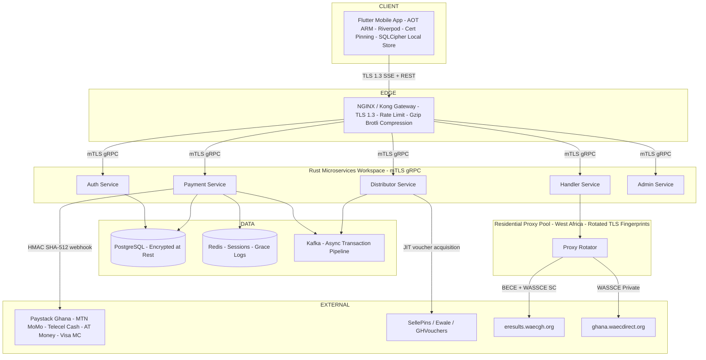
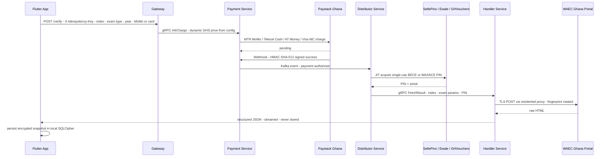
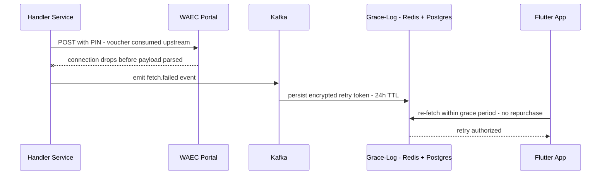
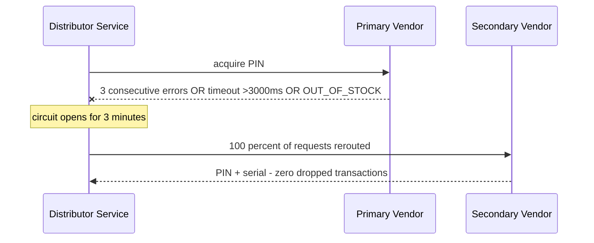
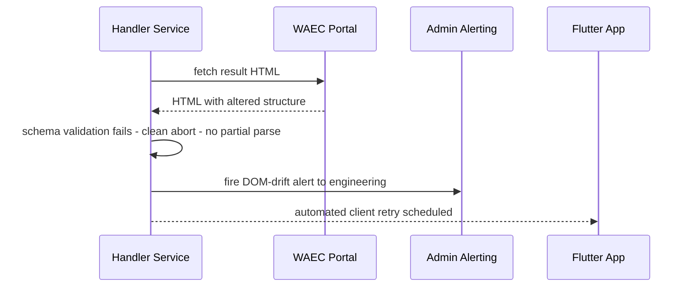

# Enterprise Implementation Plan — WAEC Automated Verification & Direct Retrieval Platform

**Source of truth:** `docs/Now that we have everything figured out, get me a....md` + Stakeholder Decision Appendix (resolved)
**Workspace:** `/home/edward-nyame/Desktop/waec-app`
**Status:** Proposed — pending user approval
**Infrastructure provider:** Hetzner Cloud — see [`plans/hetzner-infrastructure-plan.md`](hetzner-infrastructure-plan.md)
**Launch scope:** Ghana only — BECE, WASSCE School, WASSCE Private (Nov-Dec "Nwasie")

---

## 1. Executive Summary

Build a production-grade platform that retrieves official WAEC results on demand for Ghanaian candidates. The system follows an **On-Demand Direct Retrieval Architecture**: payment and verification happen in real time, raw candidate grades are **never persisted server-side**, and voucher acquisition is **Just-in-Time** via Ghanaian wholesale vendors (SellePins / Ewale / GHVouchers).

Core pillars:

1. **Zero-Trust security** — AES-256-GCM payloads, mTLS inter-service, TLS 1.3 edge, certificate pinning, Argon2id credentials, RS256 JWTs.
2. **Zero server data liability** — no persistent server storage of raw student grades; results live only in client memory and **encrypted local SQLCipher storage owned by the user until deleted**.
3. **Ghana-optimized reliability** — idempotency keys, exponential backoff with jitter, SSE with adaptive short-polling fallback, Gzip/Brotli edge compression for sub-10KB payloads on congested 2G/3G/4G networks.
4. **Resilience** — atomic transaction logging, 24-hour grace-period re-fetch, circuit-breaker vendor failover (3 errors / >3000ms / OUT_OF_STOCK → open 3 min → 100% reroute).
5. **Observability** — Prometheus metrics, distributed tracing, structured audit logs, DOM-change alerts.

---

## 2. Resolved Stakeholder Decisions (Appendix A)

| Category           | Technical Specification                                                                                             | Operational Target                                                                                                     |
| ------------------ | ------------------------------------------------------------------------------------------------------------------- | ---------------------------------------------------------------------------------------------------------------------- |
| Geographic Scope   | **Ghana only** — all Nigerian localization, NGN logic, cross-border sub-accounts stripped                           | Single-region focus, local regulatory compliance                                                                       |
| Exam Types         | **BECE** (Junior High), **WASSCE School** (May/June), **WASSCE Private / Nov-Dec ("Nwasie")**                       | Full coverage of Ghanaian basic & secondary exams                                                                      |
| Payment Gateway    | **Paystack Ghana** — MTN MoMo, Telecel Cash, AT Money, local Visa/Mastercard                                        | GHS direct settlement; **dynamic pricing via backend config endpoint**                                                 |
| Voucher Vendors    | **SellePins, Ewale, GHVouchers API** — JIT acquisition of BECE & WASSCE PINs                                        | Circuit breaker: 3 consecutive HTTP errors, timeout >3000ms, or OUT_OF_STOCK → open 3 min → 100% failover to secondary |
| WAEC Portals       | `eresults.waecgh.org` (BECE / WASSCE SC), `ghana.waecdirect.org` (WASSCE Private)                                   | Decoupled DOM schema validation; clean abort → auto client retry → engineering alert                                   |
| Anti-Blocking      | Rotated **West African residential proxy IPs** + randomized browser TLS fingerprints                                | Bypass WAEC WAF rate-limiting of backend gateway                                                                       |
| Network Resiliency | Exponential backoff + jitter (base 1.5s, max 3 retries); `X-Idempotency-Key` (UUIDv4) on all payment/fetch requests | Survive tower handoffs; zero double-charges / duplicate vouchers                                                       |
| Realtime Protocol  | **SSE over HTTP/2** with adaptive **2-second short-polling fallback** to `/transaction/status/{id}`                 | UI overlay updates under unstable carrier connections                                                                  |
| Payload Efficiency | Gzip/Brotli compression at NGINX edge                                                                               | Result payloads **< 10KB** for congested 2G/3G links                                                                   |
| Data Storage       | **Zero server storage + encrypted local SQLCipher**                                                                 | 100% client-side ownership, infinite duration until user deletes                                                       |

---

## 3. System Architecture

### 3.1 High-Level Topology



### 3.2 Request Lifecycle — Happy Path



### 3.3 Failure Paths

**Mid-fetch disruption:**



**Vendor degradation (circuit breaker):**



**DOM schema drift:**



---

## 4. Repository Layout

```
waec-app/
├── docs/                          # Existing architecture documents
├── plans/                         # This plan + ADRs
├── mobile/                        # Flutter application
│   ├── lib/
│   │   ├── core/                  # Design tokens, theme, crypto, network, pinning
│   │   │   ├── network/           # SSE client, polling fallback, backoff+jitter, idempotency keys
│   │   │   └── storage/           # SQLCipher encrypted local result store
│   │   ├── features/
│   │   │   ├── auth/              # Onboarding, biometric login
│   │   │   ├── verification/      # Unified verification screen (BECE / WASSCE SC / Nwasie)
│   │   │   ├── processing/        # Staged progress overlay (SSE + polling)
│   │   │   ├── results/           # Official result canvas
│   │   │   └── history/           # Transaction history + grace re-fetch + local archive
│   │   └── main.dart
│   ├── android/  ios/
│   └── pubspec.yaml
├── microservices/
│   ├── Cargo.toml                 # Workspace manifest
│   ├── common/                    # Shared crate: crypto, errors, telemetry, pb types
│   │   └── src/{crypto.rs, jwt.rs, errors.rs, telemetry.rs}
│   ├── proto/                     # Single source of truth for gRPC contracts
│   ├── auth/                      # Argon2id + RS256 JWT
│   ├── payment/                   # Paystack Ghana engine + webhook verification + dynamic GHS pricing
│   ├── distributor/               # JIT voucher acquisition + circuit breaker (SellePins / Ewale / GHVouchers)
│   ├── handler/                   # Dual-portal scraper + schema-validated DOM parser + proxy egress
│   └── admin/                     # RBAC, metrics, audit endpoints, DOM-drift alerting
├── infra/
│   ├── terraform/                 # IaC — hcloud provider, single CPX22 node (see plans/hetzner-infrastructure-plan.md)
│   ├── gateway/                   # NGINX edge configs, mTLS CA setup, Gzip/Brotli
│   ├── proxy/                     # Residential proxy pool config + TLS fingerprint rotation
│   └── compose/                   # Docker Compose: compose.yaml + compose.prod.yaml + compose.dev.yaml
├── .github/workflows/             # CI/CD pipelines
└── scripts/                       # Codegen, cert generation, seed data
```

---

## 5. Phased Delivery Plan

### Phase 0 — Foundation, Governance & Tooling

| #   | Task                                                                                                                                                             | Acceptance Criteria                                                              |
| --- | ---------------------------------------------------------------------------------------------------------------------------------------------------------------- | -------------------------------------------------------------------------------- |
| 0.1 | Scaffold monorepo: Flutter app, Cargo workspace, `common` crate, `proto/` dir                                                                                    | `cargo check` and `flutter analyze` pass clean                                   |
| 0.2 | Implement shared `CryptoEngine` — AES-256-GCM, dynamic 96-bit IVs, encrypt/decrypt round-trip                                                                    | Unit tests: round-trip, tamper detection, nonce uniqueness across 10k iterations |
| 0.3 | Add Argon2id hashing utilities + RS256 JWT sign/verify helpers to `common`                                                                                       | Test vectors pass; key rotation supported via `kid` header                       |
| 0.4 | Define protobuf contracts: `auth.proto`, `payment.proto`, `distributor.proto`, `handler.proto`, `admin.proto` — exam types enum: BECE, WASSCE_SC, WASSCE_PRIVATE | `buf lint` clean; codegen emits Rust + docs                                      |
| 0.5 | Error taxonomy + domain types crate (no `String` errors in service code)                                                                                         | All services compile against typed errors                                        |
| 0.6 | Telemetry crate: `tracing` + OpenTelemetry exporters, correlation IDs                                                                                            | Spans propagate across gRPC calls                                                |
| 0.7 | CI pipeline: fmt, clippy `-D warnings`, `flutter analyze`, unit tests, SBOM via `cargo audit`                                                                    | Green on PR; branch protection enabled                                           |
| 0.8 | Secrets strategy: Vault / SOPS; no plaintext secrets in repo                                                                                                     | Pre-commit secret scanner active                                                 |

### Phase 1 — Platform Infrastructure (Hetzner Cloud, Single Node CPX22)

> Provider-level design — CPX22 spec, container topology, memory budget, firewall matrix, data-layer config, backups, DR rebuild runbook, cost model (~€15–18/mo), and scaling triggers — lives in the dedicated file [`plans/hetzner-infrastructure-plan.md`](hetzner-infrastructure-plan.md).

| #   | Task                                                                                                                                                                                                                                                         | Acceptance Criteria                                                                                 |
| --- | ------------------------------------------------------------------------------------------------------------------------------------------------------------------------------------------------------------------------------------------------------------ | --------------------------------------------------------------------------------------------------- |
| 1.1 | Terraform (`hcloud` provider): single CPX22 server (fsn1, LUKS2 encrypted install), hcloud Firewall (443/80/51820-UDP only), private network `10.0.1.0/24`, cloud-init (Docker, UFW, unattended-upgrades, WireGuard); remote state on Hetzner Object Storage | `terraform plan` clean; external scan shows only 443/80/WG reachable                                |
| 1.2 | Docker Compose runtime (not Kubernetes): compose.yaml + compose.prod.yaml with restart policies, healthchecks, and `mem_limit`/`cpus` on every container per the 8 GB memory budget; edge/internal/data Docker networks with mTLS on internal                | Full stack boots with all healthchecks passing within 2 minutes; data network not internet-routable |
| 1.3 | Internal PKI: CA, per-service certs, automated rotation via scripted certbot/internal CA                                                                                                                                                                     | mTLS handshake verified service-to-service                                                          |
| 1.4 | Gateway config: TLS 1.3 only, HSTS, rate limiting, DDoS rules, CORS allowlist, path routing, **Gzip/Brotli compression**, Let's Encrypt automation                                                                                                           | Load test: 429s under threshold breach; TLS scan grade A; **result payloads < 10KB verified**       |
| 1.5 | Local dev parity: same compose files + `compose.dev.yaml` override with Postgres, Redis, Kafka, gateway, all services, mock WAEC portals                                                                                                                     | `docker compose up` boots full stack locally                                                        |
| 1.6 | Observability stack (memory-capped): Prometheus, Grafana, Loki with 15d/7d retention, node_exporter + cadvisor                                                                                                                                               | Golden signals dashboard per service; alerts fire in staged test                                    |
| 1.7 | Residential proxy pool setup: West African IP ranges, rotation policy, TLS fingerprint randomization config; Handler egress never uses Hetzner DC IPs                                                                                                        | Egress requests show rotating IPs + varied JA3 fingerprints                                         |
| 1.8 | Backups + DR: pgBackRest WAL → encrypted Object Storage, Hetzner automated backups, pre-deploy snapshots, single-node rebuild runbook, quarterly restore drill                                                                                               | Restore drill completes within RTO ≤ 2 h with ≤ 5 min data loss                                     |

### Phase 2 — Backend Microservices

| #   | Service         | Key Deliverables                                                                                                                                                                                                                                                                                                                                                                                                                                        | Acceptance Criteria                                                                                                                                                                           |
| --- | --------------- | ------------------------------------------------------------------------------------------------------------------------------------------------------------------------------------------------------------------------------------------------------------------------------------------------------------------------------------------------------------------------------------------------------------------------------------------------------- | --------------------------------------------------------------------------------------------------------------------------------------------------------------------------------------------- |
| 2.1 | **Auth**        | Registration, login, Argon2id verification, RS256 JWT issuance + refresh, biometric token binding                                                                                                                                                                                                                                                                                                                                                       | Brute-force lockout; JWT expiry ≤ 15 min; refresh rotation                                                                                                                                    |
| 2.2 | **Payment**     | **Paystack Ghana** charge init for **MTN MoMo, Telecel Cash, AT Money, Visa/MC**; **dynamic GHS pricing served from backend config endpoint**; HMAC SHA-512 webhook verification; **`X-Idempotency-Key` (UUIDv4) enforcement — duplicate keys return original outcome, never double-charge**; idempotent event processing; Kafka publish on authorization                                                                                               | Replay of duplicate webhook is a no-op; invalid signature rejected 401; replayed idempotency key returns cached result                                                                        |
| 2.3 | **Distributor** | JIT voucher acquisition via **SellePins / Ewale / GHVouchers** for BECE + WASSCE PINs; **circuit breaker: 3 consecutive HTTP errors, timeout >3000ms, or OUT_OF_STOCK → open 3 minutes → 100% reroute to secondary vendor**; retry with exponential backoff; PIN never logged                                                                                                                                                                           | Vendor outage simulation triggers failover with zero dropped transactions; zero PIN leakage in logs                                                                                           |
| 2.4 | **Handler**     | TLS clients to **`eresults.waecgh.org`** (BECE / WASSCE SC) and **`ghana.waecdirect.org`** (WASSCE Private); **decoupled DOM schema validation — on structure change: clean abort, no partial parse, fire engineering alert, schedule automated client retry**; **egress via rotated West African residential proxies + randomized browser TLS fingerprints**; fast DOM parser → structured JSON; streaming response; explicit no-persistence guarantee | Parser handles both portals via schema configs; recorded HTML fixture tests; DOM-drift simulation aborts cleanly + alerts; egress shows rotating proxies; grep proves no grade writes to disk |
| 2.5 | **Admin**       | RBAC endpoints, transaction audit log queries, Prometheus metrics exposure, health/readiness probes, **DOM-drift alert routing**                                                                                                                                                                                                                                                                                                                        | Non-admin token → 403; metrics endpoint protected                                                                                                                                             |
| 2.6 | **Transport**   | gRPC over mTLS via rustls for all inter-service calls; deadline + retry policies; **SSE over HTTP/2 endpoint for transaction stage events**                                                                                                                                                                                                                                                                                                             | mTLS required — plaintext gRPC port disabled in prod; SSE stream emits Payment Verified → PIN Acquired → Fetching Result                                                                      |
| 2.7 | **Data**        | Single-node data layer on CPX22: PostgreSQL 16 (pgcrypto encrypted transaction-log columns, LUKS2 disk), Redis 7 (AOF, sessions + 24 h grace TTL keys only), single-broker Kafka KRaft (RF=1, tuned heap); schema: users, encrypted transaction logs, payment verification records, grace-period pointers; Kafka topics with DLQ; **pricing config table for dynamic GHS rates**; audit topics mirrored to PostgreSQL                                   | Schema migrations versioned; grace keys expire at 24 h; pricing endpoint returns current exam fees; backup/restore drill passes                                                               |

### Phase 3 — Flutter Mobile Application

| #    | Task                                                                                                                                                                                                                                                                                                                    | Acceptance Criteria                                                                              |
| ---- | ----------------------------------------------------------------------------------------------------------------------------------------------------------------------------------------------------------------------------------------------------------------------------------------------------------------------- | ------------------------------------------------------------------------------------------------ |
| 3.1  | Design system: tokens `#0A2540` navy, `#00D4B1` mint, canvas `#F8FAFC` / `#051424`, cards `#FFFFFF` / `#0D1F35`, Public Sans typography, light + dark themes                                                                                                                                                            | Theme switcher demo; tokens centralized in one file                                              |
| 3.2  | Auth & onboarding screen: 10-digit index number validation, password entry, biometric login via platform keystores                                                                                                                                                                                                      | Biometric fallback to PIN; index format enforced                                                 |
| 3.3  | Unified verification screen: index, **exam type selector — BECE / WASSCE School / WASSCE Private (Nwasie)**, exam year, **MTN MoMo / Telecel Cash / AT Money / card** selection, CTA with **dynamic GHS price fetched from backend config**                                                                             | Form validation complete; CTA disabled until valid; price reflects server config                 |
| 3.4  | Direct processing overlay: staged progress — Payment Confirmation → Voucher Provisioning → WAEC Direct Retrieval; **driven by SSE over HTTP/2 with graceful degradation to adaptive 2-second short-polling of `/transaction/status/{id}` when carrier breaks long-lived connections**                                   | Each stage reflects real backend events; forced SSE-drop test degrades to polling seamlessly     |
| 3.5  | Official result canvas: WAEC-style digital rendering, subject/grade table, 24 h grace-period badge with live countdown, uses-remaining counter                                                                                                                                                                          | Matches doc layout; countdown ticks from server time                                             |
| 3.6  | Transaction history log: past purchases, free re-fetch buttons during active grace period, **local archive of encrypted SQLCipher snapshots with user-initiated delete**                                                                                                                                                | Re-fetch within 24 h does not re-charge; archived results render offline; delete is irreversible |
| 3.7  | **Encrypted local storage: SQLCipher database on device — results persisted client-side only, infinite duration until user deletes; server retains zero grade data**                                                                                                                                                    | DB file encrypted at rest; uninstall removes all data; no grade plaintext outside SQLCipher      |
| 3.8  | Riverpod in-memory state: result payloads held only in state trees; auto zero-out on screen disposal and app backgrounding                                                                                                                                                                                              | Memory dump test shows no residual grade data after backgrounding                                |
| 3.9  | Network layer: TLS 1.3, SHA-256 certificate pinning compiled into binary, pinned-key rotation strategy; **exponential backoff with randomized jitter — base delay 1.5s, max 3 retries — on all gateway requests**; **`X-Idempotency-Key` UUIDv4 attached to every payment and fetch request, preserved across retries** | App refuses MITM proxy; retry storm simulation produces exactly one charge and one voucher       |
| 3.10 | Export: PDF export and image save of result canvas                                                                                                                                                                                                                                                                      | Files generated client-side; no upload                                                           |

### Phase 4 — Resilience, Security Hardening & Risk Mitigation

| #    | Risk                                               | Mitigation Implementation                                                                                                                     | Verification                                                           |
| ---- | -------------------------------------------------- | --------------------------------------------------------------------------------------------------------------------------------------------- | ---------------------------------------------------------------------- |
| 4.1  | Network disruption mid-fetch                       | Atomic transaction logging before egress; auto-issued re-fetch tokens within 24 h grace on parse failure                                      | Chaos test: kill Handler mid-scrape; user re-fetches free              |
| 4.2  | Client memory dumps on rooted devices              | Dart AOT obfuscation (`--obfuscate --split-debug-info`), RAM purge on background/dispose                                                      | Obfuscated build symbols unrecoverable                                 |
| 4.3  | Local device data loss                             | Server-side encrypted grace-log with index pointers enabling re-trigger without repurchase; **SQLCipher local archive survives app restarts** | Uninstall + reinstall within grace → re-fetch works                    |
| 4.4  | Voucher API latency/degradation                    | **Circuit breaker (3 errors / >3000ms / OUT_OF_STOCK → 3 min open) + automatic 100% failover to secondary vendor**                            | Fault-injection test passes; no dropped transactions                   |
| 4.5  | Webhook forgery                                    | HMAC SHA-512 signature verification + timestamp window                                                                                        | Forged webhook rejected                                                |
| 4.6  | Credential stuffing                                | Argon2id + rate limiting + lockout                                                                                                            | Load test with bad credentials → lockout                               |
| 4.7  | **WAEC WAF blocking / rate-limiting backend**      | Rotated West African residential proxy IPs + randomized browser TLS fingerprints                                                              | Sustained scrape load without IP bans; fingerprint diversity verified  |
| 4.8  | **WAEC portal DOM changes**                        | Decoupled schema validation, clean abort, engineering alert, automated client retry                                                           | DOM-drift simulation: no partial results served; alert received        |
| 4.9  | **Double-charging on flaky Ghana mobile networks** | `X-Idempotency-Key` UUIDv4 enforced end-to-end; backend deduplication                                                                         | Duplicate request replay returns original outcome; zero double charges |
| 4.10 | **SSE connection drops on congested towers**       | Adaptive 2-second short-polling fallback to `/transaction/status/{id}`                                                                        | Forced disconnect test completes journey via polling                   |

### Phase 5 — Quality Assurance & Testing Strategy

| #   | Layer       | Scope                                                                                                                                                              |
| --- | ----------- | ------------------------------------------------------------------------------------------------------------------------------------------------------------------ |
| 5.1 | Unit        | Crypto round-trips, JWT lifecycle, HMAC verification, HTML parser fixtures for **both portals**, form validators, circuit-breaker state machine                    |
| 5.2 | Integration | Service-to-service gRPC over mTLS in compose stack; **Paystack Ghana sandbox** (MTN MoMo, Telecel Cash, AT Money, cards); vendor sandbox adapters                  |
| 5.3 | Contract    | Protobuf compatibility checks in CI (buf breaking)                                                                                                                 |
| 5.4 | E2E         | Flutter integration tests: full payment → retrieval → grace re-fetch journey on emulator; **degraded-network scenarios (3G throttle, packet loss, tower handoff)** |
| 5.5 | Security    | SAST, dependency audit, secret scanning, TLS config scan, mobile pen-test checklist, MITM + memory-dump verification, **SQLCipher at-rest encryption audit**       |
| 5.6 | Performance | Load test gateway + Handler scrape path; vendor fallback under latency; Kafka throughput; **payload size assertion < 10KB compressed**                             |
| 5.7 | Chaos       | Mid-fetch kill tests, Redis/Kafka broker loss, vendor 5xx storms, **SSE connection severance**, **idempotency replay storms**                                      |

### Phase 6 — Release, Operations & Compliance

| #   | Task                                                                                                                                                                                   | Acceptance Criteria             |
| --- | -------------------------------------------------------------------------------------------------------------------------------------------------------------------------------------- | ------------------------------- |
| 6.1 | CD pipelines: staged deploys dev → staging → prod, blue/green or canary for services                                                                                                   | Rollback < 5 min                |
| 6.2 | Runbooks: vendor outage, Paystack webhook backlog, **WAEC portal DOM change (both portals)**, cert expiry, **proxy pool exhaustion**                                                   | Each runbook tested in game-day |
| 6.3 | Alerting: golden signals, grace-token anomaly spikes, webhook failure rate, cert expiry warnings, **DOM-drift alerts, circuit-breaker state changes, proxy pool health**               | On-call routing configured      |
| 6.4 | Compliance review: data-flow audit proving **zero server-side grade persistence** (client SQLCipher only); retention policy for transaction logs; **Ghana data protection compliance** | Signed-off audit checklist      |
| 6.5 | Store submission prep: Play Store / App Store metadata, privacy policy reflecting zero-server-storage + local SQLCipher model                                                          | Submission packages ready       |

---

## 6. Definition of Done — Global

- All services pass `clippy -D warnings`, unit + integration tests, and expose health/readiness/metrics endpoints.
- No secret, PIN, or raw grade value appears in any log, database, or trace — verified by automated log scanning.
- Every external call has a timeout, retry policy, and circuit breaker where applicable.
- Every user-facing flow has an error state and a recovery path.
- All client payment/fetch requests carry idempotency keys; zero double-charge path proven by tests.
- Result payloads compress to under 10KB at the edge.
- Documentation: README per service, ADRs for major decisions, updated architecture diagrams.

---

## 7. Decision Log

| Decision               | Choice                                                                    | Rationale                                                              |
| ---------------------- | ------------------------------------------------------------------------- | ---------------------------------------------------------------------- |
| Launch geography       | Ghana only                                                                | Single-region regulatory + payment simplicity; Nigerian scope stripped |
| Exam coverage          | BECE, WASSCE School, WASSCE Private (Nwasie)                              | Full Ghanaian basic & secondary exam coverage                          |
| Payment rails          | Paystack Ghana — MTN MoMo, Telecel Cash, AT Money, Visa/MC                | Local GHS settlement on dominant mobile money rails                    |
| Pricing model          | Dynamic GHS via backend config endpoint                                   | Fee changes without app releases                                       |
| Voucher vendors        | SellePins (primary), Ewale / GHVouchers (failover)                        | Ghanaian wholesale PIN suppliers                                       |
| Circuit breaker policy | 3 consecutive errors / >3000ms / OUT_OF_STOCK → 3 min open → 100% reroute | Fast failover without dropping transactions                            |
| WAEC portals           | `eresults.waecgh.org` + `ghana.waecdirect.org`                            | Official endpoints per exam type                                       |
| Anti-blocking          | Rotated West African residential proxies + randomized TLS fingerprints    | Evade WAEC WAF rate-limiting                                           |
| Realtime protocol      | SSE over HTTP/2 + adaptive 2s polling fallback                            | Lightweight, native reconnect, resilient on unstable carriers          |
| Client storage         | Encrypted local SQLCipher, infinite until user delete                     | 100% client-side ownership; server stores zero grades                  |
| Payload budget         | < 10KB compressed (Gzip/Brotli at edge)                                   | Fast delivery on congested 2G/3G links                                 |
